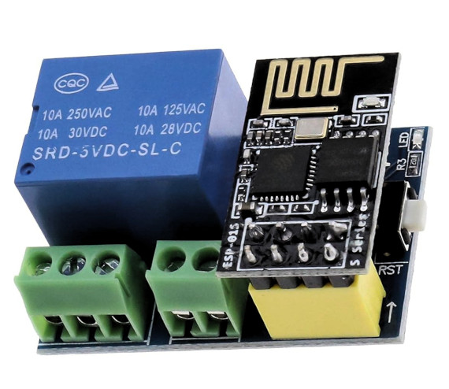

# KitchenLight
This is a light controlling system in my kitchen.
It should turn on and off the light depending on the daily twilight.

As the HW the ESP-01 relay module is used:

Before compilation please create 'config/secret.ini' based on the template and fill the required data.
